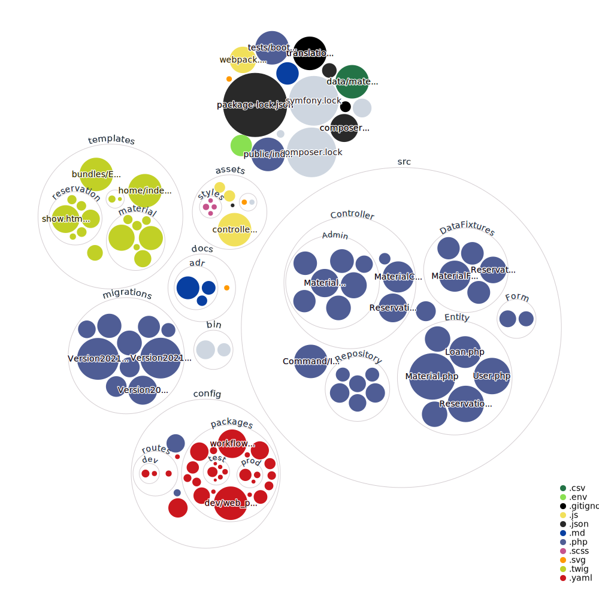

# Description

The Franciscus Material Management is an application build with the <strong>Symfony Framework</strong> that allows the users to manage the loaning of materials. At our Scouting group, the materials are shared between multiple teams. This management tool primarily makes sure the materials are not used at the same time, while also providing features to allow for easy management in general.  

# Installation

1. This project is set up with PHP version 7.4 in combination with Composer. So make sure they are installed.
1. When the project is downloaded, first don't forget to run `composer install` to download all dependencies.
1. Then you can start a local server to run the project with `symfony server:start`.
1. The next step is to create the database with its tables, which can be done with `php bin/console doctrine:database:create` and then `php bin/console doctrine:migrations:migrate -n`.
1. For local development, you can then fill the database with dummy data with `php bin/console doctrine:fixtures:load`.
1. To activate the front-end, run `npm install `and next `npm run dev`. During development it might be your preference to run `npm run watch` in the background to automatically recompile your front-end related changes.
1. Finally, to easily open the website you can use `symfony open:local`. 

# Data import

You can update the data for the materials via a CSV file with the own implemented command `php bin/console import-material [filename]`. The filename is optional and will load a .csv file in the /data directory.

# Screenshots

Further down the development of this tool, we will provide some screenshots to give you a sense of what it looks like.

# Visualization of the codebase

